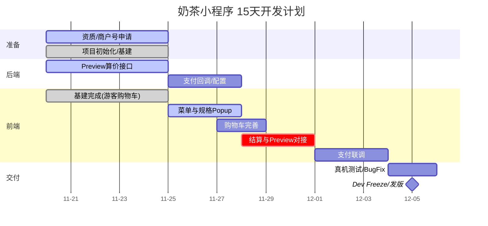

# 🗺️ 奶茶小程序项目总路线图 (Roadmap)

**版本**：V1.0.0 (MVP)
**技术栈**：原生微信小程序 + TypeScript + MobX + TDesign
**负责人**：小菊 (PM/QA)
**周期**：2025.11.20 - 2025.12.05（15 天开发周期）
**目标**：完成前端开发与联调，具备上线能力

---

## 1. 摘要与 KPI (Summary)

**核心目标**：15 天内完成"智能奶茶档口"小程序的 MVP 开发与联调，实现线上点单、自提/配送闭环。

**KPI**：

* 功能完备：主流程（点单→算价→支付→接单）跑通，无阻断性 Bug（P0=0）。
* 体验达标：**首屏 LCP < 1.5s**（4G），交互首字节 < 200ms。
* 稳定性：前端崩溃率 < **0.3%**；支付失败率 < **2%**。
* 交付准时：**12/05** 输出可供测试/上线的 Release 包。

---

## 2. 范围 (Scope)

**✅ MVP 包含 (In Scope)**

* 游客模式浏览、延迟登录（结算/支付时授权）
* 菜单浏览、多规格 Popup（杯型 UI 隐藏但参与计价）
* 游客/用户双模式购物车 + 登录后自动合并
* 购物车 + 服务端算价（`POST /orders/preview`）
* 微信支付、订单超时取消（15 分钟）
* 商家自配送（10km 校验）、到店自提
* 优惠券选择、集点（满10杯送1，MVP：后台人工核销/手工累计）
* 适老化主题支持

**❌ 本期不做 (Out of Scope)**

* H5、支付宝小程序
* 线上自动退款流程（电话处理）
* 复杂的储值余额支付
* 复杂动效与过度转场
* 骑手端/配送员端

---

## 3. 里程碑与时间线 (Milestones)

| 节点 | 时间           | 里程碑        | 交付物                                            | 验收标准                          |
| -- | ------------ | ---------- | ---------------------------------------------- | ----------------------------- |
| M0 | 11.20        | 项目启动       | 需求定稿、Git 仓初始化、合法域名白名单提交                        | 能跑 Hello World；API 文档确认       |
| M1 | 11.21-11.25  | 基建完成       | MobX/Request 封装、游客购物车、支付商户号提交（Owner: 小菊）       | 游客模式可加购；lint 0 错；基础页面就绪        |
| M2 | 11.26-11.30  | 业务开发       | 菜单/规格选择/结算页开发完毕                                | 能加购；`preview` 调通；E2E 主链路通过    |
| M3 | 12.01-12.03  | 支付联调       | 微信支付联调畅通、订单状态流转                                | 真机可唤起支付；状态更新正确；P0=0           |
| M4 | 12.04-12.05  | Dev Freeze | 提测包（Release Candidate）                         | Checklist 全绿；回滚演练通过（10 分钟内恢复） |

> **Exit Criteria 强化**：
>
> * M2：`preview` 成功率 ≥ 99%，接口 P95 < 800ms
> * M3：支付成功率 ≥ 98%，真机 LCP ≤ 2.5s

---

## 4. WBS 工作分解 (Work Breakdown)

### 🏗 基建与公共（Frontend Infra）【11.20–25】

* 原生小程序项目初始化（TypeScript + MobX）；`app.json` 路由与分包规划
* 网络层封装：`wx.request` 拦截器（Token、Idempotency-Key、错误码）
* 状态管理：MobX（`UserStore`、`ShopStore`、`CartStore`、`MenuStore`）+ 本地持久化
* 游客购物车：独立存储 + 登录后自动合并
* UI 组件：TDesign 小程序版；自定义导航栏、TabBar、商品卡片
* 适老化主题：主题变量配置 + 手动切换

### 🥤 核心业务（Core Features）【11.26–12.03】

* 菜单页：左右联动（scroll-view）、懒加载、加购入口、搜索功能
* 规格 Popup：使用 TDesign t-popup，默认选中规则（中杯/常规糖/常规冰）、库存置灰、热饮隐藏冰度
* 购物车：增减数量（t-stepper）、失效项置灰、清空与重算、游客/用户模式
* 结算页（重头戏）：登录拦截、地址选择（wx.chooseLocation）、`/orders/preview` 防抖（≥200ms）、优惠券面板 + 集点展示
* 支付流程：`X-Idempotency-Key` 生成、`wx.requestPayment`、成功/取消分支
* 订单管理：订单列表（t-tabs）、订单详情（t-steps）、取餐码展示

### 🔌 后端支持（Backend Support）【11.20–23】

* 高优：实现 `POST /orders/preview` 算价核心（金额两位小数字符串）
* 高优：`/shop/delivery/check` 10km 校验逻辑；返回 `distance_m`
* 配置：`dev/staging/prod` 环境拆分与灰度开关

### 🧪 测试与运维（QA & Ops）【11.29–30】

* 真机调试：iPhone / Huawei / Xiaomi（含低端机）
* 弱网测试：≥200ms RTT 抖动；`preview` 重试退避
* 体验评分自检；发版流水线与提审物料准备

---

## 5. RACI 分工矩阵

**R（Responsible）执行｜A（Accountable）拍板｜C（Consulted）协作｜I（Informed）知会**

| 任务包       | R      | A     | C           | I  |
| --------- | ------ | ----- | ----------- | -- |
| 需求定义（PRD） | PM     | Owner | FE/BE/QA/设计 | 全员 |
| 前端实现      | FE     | Owner | 设计/QA       | PM |
| 后端 API    | BE     | Owner | FE/QA       | PM |
| 资质与支付配置   | PM(小菊) | Owner | 财务/BE       | 团队 |
| UI 还原验收   | 设计     | Owner | FE          | PM |
| 最终产品验收    | PM     | Owner | FE/BE/QA    | 团队 |
| 发布与回滚     | FE     | Owner | BE/QA       | 运营 |

---

## 6. ⚠️ 风险与预案 (Risks & Mitigations)

| 风险项             | 等级   | 触发信号           | 预案（Plan B）                               |
| --------------- | ---- | -------------- | ---------------------------------------- |
| 微信支付未开通         | 🔥P0 | 11/25 商户号未审核通过 | 延期上线支付；MVP 保留“自提不支付”演示流 + Mock 支付回调；持续催审 |
| 算价 `preview` 延期 | P1   | 11/23 不可用/错误率高 | 前端先用假数据联通 UI；接口就绪后切换；降级只保留自提无券无积分        |
| 地图 Key 额度限制     | P2   | 选点报错/限额        | 临时切文本地址输入；外卖下单禁用，保留自提                    |
| 10 天工期不足        | P2   | 11/27 结算未完     | 砍掉优惠券 & 集点仅展示，仅保留基础点单+支付                 |
| 包体超限（>2MB）      | P2   | 打包超限           | 分包、按需引入、图片瘦身（WebP、w=200/600）             |

---

## 7. 指标与监控 (Metrics & Monitoring)

* **性能**：LCP、TTI、`/orders/preview` / 支付接口 P95
* **质量**：JS 错误率、崩溃率、接口 5xx 占比
* **业务**：加购→下单→支付漏斗、券使用率、集点兑换率、超距触发率
* **告警阈值**：`preview P95 > 800ms（连续 5 分钟）`、`支付失败率 > 2%` 报警
* **工具**：Sentry/前端埋点、可用性探针（脱敏：手机号仅后 4 位）

---

## 8. 沟通与变更 (Comms & Change)

* **每日站会**：10:00，三问（昨天/今天/阻塞）≤5 分钟
* **周评审**：Roadmap 对齐与变更决策；记录到 `docs/DECISIONS.md`
* **变更控制**：11/25 后严禁新增需求；若必须变更，遵循“**砍一换一**”原则

---

## 9. DoD 验收标准 (Definition of Done)

* **代码**：Git 提交规范；ESLint/TypeCheck 通过；关键逻辑有注释
* **功能**：PRD 核心用例全通；E2E 主链路用例全绿
* **体验**：真机无白屏/崩溃；首屏/接口耗时达标
* **环境**：生产 API 配置正确；支付参数验证通过
* **回滚**：演练通过（10 分钟内恢复）

---

## 10. 甘特图 (W1–W2)

---

## 11. 发布与审核 Checklist（WeChat 提审）

* [ ] 服务器域名白名单（https/wss）& 证书有效
* [ ] 业务类目、权限用途说明、**隐私政策**链接\n- [ ] 《隐私政策》：生成 docs/privacy.md，并在小程序“关于与隐私”页中提供链接
* [ ] 体验版账号与审核视频/截图、客服电话
* [ ] 体验评分 ≥ 80、真机性能报告（首屏/LCP/接口 P95）
* [ ] 异常与兜底说明页（支付失败/超距/售罄）

---

## 12. 环境与配置表（固化）

| 环境      | BaseURL                                        | APPID | MchID | 支付证书 | MapKey         | 说明/开关文件                           |
| ------- | ---------------------------------------------- | ----- | ----- | ---- | -------------- | --------------------------------- |
| dev     | [http://127.0.0.1:xxxx](http://127.0.0.1:xxxx) | （待填）  | （待填）  | 本地   | 腾讯地图（QQMap，待填） | /config/dev.json（本地地址写在 .env.dev） |
| staging | （待定）                                           | （待填）  | （待填）  | 预发   | 腾讯地图（QQMap，待填） | /config/stg.json                  |
| prod    | [https://guajunyan.top](https://guajunyan.top) | （待填）  | （待填）  | 生产   | 腾讯地图（QQMap，待填） | /config/prod.json                 |

> 任何 prod 配置变更需 Owner 审批并记录 `DE## 13. 灰度与回滚策略（Kill-Switch）

* 初始：外卖 **开启**\n- ETA_FALLBACK_TEXT：前方排队制作中，预计等待时间请留意通知\n- 后端开关：witch）
  灰度与回滚策略（Kill-Switch）
* 后端开关：`STOP_TAKING_ORDERS`、`DISABLE_DELIVERY`、`ETA_FALLBACK_TEXT`
* 客户端远程配置：可下发“仅保留自提”、关闭优惠券/关闭集点兑换
* 回滚 SOP：上一稳定版包名/版本号、负责人、目标 10 分钟恢复

---

## 14. 设备矩阵与兼容范围

* iOS 13/15/17（iPhone 8 / 12 / 14）；Android 10/12/14（华为/小米/OPPO）
* 微信基础库 ≥ 2.32；弱网（3G/200ms+ 抖动）必须可完成下单

---

## 15. 测试数据（最小集）

* 用户：已授权手机号 ×3
* 优惠券：满 30-5 / 已过期 / 不满足门槛
* 商品：正常 / 临界（1 件）/ 售罄；“热饮”隐藏冰度
* 地址：9.9km & 10.1km 各 1 条

---

## 16. 变更记录（Changelog）

* **V1.0.1 (2025-11-25)**：适配原生微信小程序技术栈（TypeScript + MobX + TDesign）；调整开发周期为 15 天；新增游客模式购物车、延迟登录策略、适老化主题支持；更新技术架构和组件选型。
* **V1.0.0 (MVP)**：初始版本，融合冲刺计划 + 监控/灰度/回滚/Checklist；强化里程碑 Exit Criteria；杯型 UI 隐藏但参与计价。
