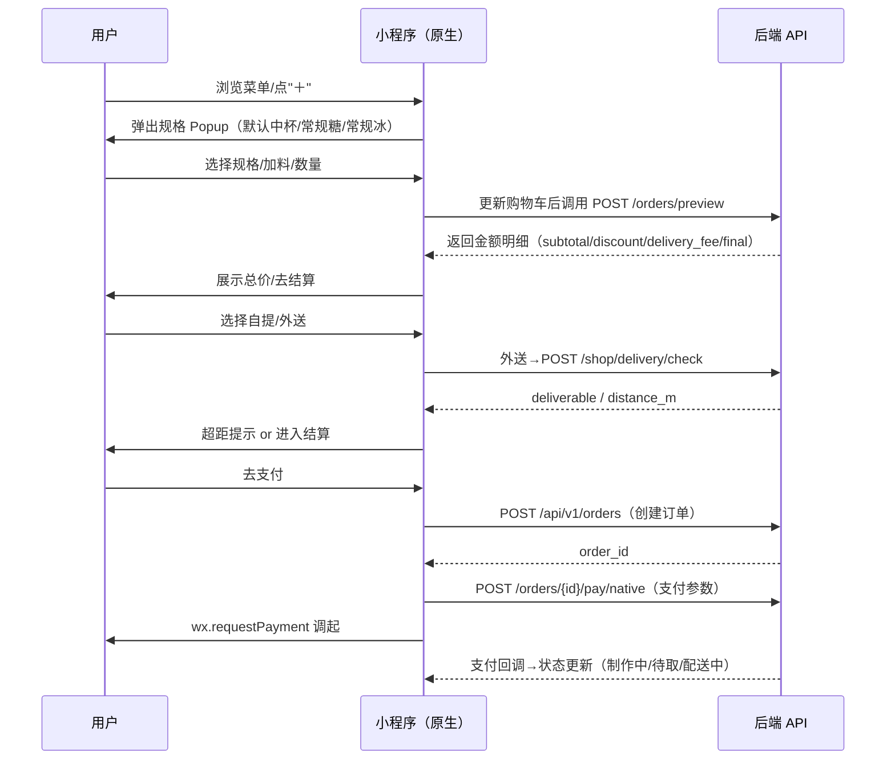

# 🧋 奶茶点单小程序 PRD（原生版 · v1.0.0-RC）

**Owner**：小菊
**目标平台**：微信小程序
**技术栈**：原生微信小程序 + TypeScript + MobX
**UI 组件库**：TDesign 小程序版
**核心接口**：`POST /orders/preview`（算价唯一真相）
**环境**：dev=本地 `http://127.0.0.1:xxxx`｜prod=`https://guajunyan.top`（staging 待定）
**状态**：开发就绪（RC）

---

## 1. 背景与目标（Context & Goals）

* **痛点**：高峰期前台拥堵、沟通成本高、等待不可预期。
* **方案**：小程序自助点单 + 动态算价 + 取餐码/自配送，减少人工干预。
* **KPI**：首屏 LCP < 1.5s；下单转化↑；支付失败率 < 2%；崩溃率 < 0.3%。

---

## 2. 用户画像（Personas）

| 角色     | 场景         | 需求                 |
| ------ | ---------- | ------------------ |
| 自提顾客   | 路过门店，高峰想快取 | 手机下单→预计等待→到店取餐     |
| 外送顾客   | 镇内/单位想喝    | 自动判断可配送（10km）→微信支付 |
| 店员/制作员 | 高峰期出杯      | 自动出单，规格清晰，少分心      |

---

## 3. 范围（Scope）

**In（MVP）**：菜单/规格弹层、购物车、服务端算价、支付、订单、到店自提、商家自配送（10km）、优惠券、**集点（满10杯送1）**展示。
**Out**：H5/支付宝、线上自动退款、余额/储值、复杂动效、骑手端。

---

## 4. 业务流程（Process Flow）

**登录策略**：采用"延迟登录"策略，用户可以**无需登录直接浏览菜单、加购物车**（游客模式），仅在**点击结算/支付**或**查看订单/个人中心**时才要求登录。登录后会自动合并游客购物车。这符合微信小程序的最佳实践，降低用户流失率。

### 4.1 主链路



### 4.2 集点（Stamp Card）

* 规则：**满 10 杯送 1 杯**（MVP：**后台人工核销/手工累计**）。
* 赠送方式：由店员在后台核销或线下赠饮；结算页 **不进行抵扣**（仅展示进度）。

---

## 5. 功能与验收（Features & AC）

### 5.1 菜单与规格（Menu & Specs）

* **布局**：左分类/右商品流；列表图使用缩略图（WebP，w≈200）。
* **规格弹层**（TDesign：`t-popup` + `t-radio` / `t-checkbox` + `t-stepper`）：

  * 默认选中：中杯/常规糖/常规冰；**杯型 UI 不必显式展示**，但要传 spec id。
  * 热饮：不展示“冰度”选项。
  * 加料：Checkbox 项上显示 `+¥x`，选择即刻更新总价。
  * 售罄：选项/整品置灰；卡片角标“售罄”。
* **验收**：

  * 点击“＋”≤ 16ms 出弹层；选项变化 **总价即时更新**；加入购物车 Toast 成功。
  * `inventory_status=sold_out` 时按钮不可点。

### 5.2 购物车与结算（Cart & Checkout）

* **算价策略**：前端 **不算价**；任何变更都调用 `POST /orders/preview`。
* **外送校验**：地图选点→`POST /shop/delivery/check`；>10km 阻断并引导“改为自提”。
* **费用明细**：小计/优惠券/配送费/实付总额；**集点仅展示进度**（不抵扣）。
* **验收**：`preview` 成功率 ≥ 99%；切换自提/外送会重新算价。

### 5.3 订单与支付（Order & Pay）

* **支付**：`wx.requestPayment`；下单超时 15 分钟未付→自动取消（前端展示倒计时）。
* **支付后**：

  * 自提：跳“取餐码”大屏（如 A102）。
  * 外送：跳“订单详情”，展示预计送达时间（无动态则显示固定文案）。
* **售后**：订单页底部“联系商家”（电话 **待提供**）。

---

## 6. 非功能需求（NFR）

* **性能**：LCP < 1.5s；包体主包 < 2MB；预渲染骨架屏；图片按需加载（列表 w≈200，弹层/详情 w≈600）。
* **可用性**：弱网（3G/200ms+）可完成下单；按钮防抖 ≥ 1.5s；幂等 `X-Idempotency-Key`。
* **稳定性**：错误码可感知；JS 错误上报（脱敏）。

---

## 7. API 契约（摘要）

### 7.1 `GET /api/v1/menu`

**Response**（简化）：

```json
{
  "categories": [{"id": 1, "name": "奶茶"}],
  "products": [{
    "id": 101,
    "title": "芝士奶盖茶",
    "thumb": "...w=200",
    "price": 12.0,
    "inventory_status": "in_stock|sold_out",
    "spec_groups": [
      {"id": 1, "name": "甜度", "type": "radio", "options": [{"id": 11, "name": "正常", "price_modifier": 0}]},
      {"id": 2, "name": "冰度", "type": "radio", "options": [...]},
      {"id": 3, "name": "加料", "type": "checkbox", "options": [{"id": 31, "name": "珍珠", "price_modifier": 2}]}
    ],
    "default_spec_option_ids": [/* 中杯/常规糖/常规冰 */]
  }]
}
```

### 7.2 `POST /orders/preview`

**Request**：

```json
{
  "items": [
    {"product_id": 101, "quantity": 2, "spec_option_ids": [11, 21, 31]}
  ],
  "coupon_id": 123,
  "order_type": "pickup|delivery",
  "address": {"lat": 23.1, "lng": 113.3, "detail": "xx路xx号"}
}
```

**Response**：

```json
{
  "success": true,
  "data": {
    "subtotal": 36.00,
    "coupon_discount": 5.00,
    "delivery_fee": 6.00,
    "final_amount": 37.00
  }
}
```

### 7.3 `POST /shop/delivery/check`

**Request**：`{"lat": 23.1, "lng": 113.3}` → **Response**：`{"deliverable": true, "distance_m": 3210}`

### 7.4 下单与支付

* `POST /api/v1/orders` → 返回 `order_id`
* `POST /orders/{id}/pay/native` → 返回微信支付参数
* 小程序端：`Taro.requestPayment(params)`

### 7.5 集点与优惠券

* `GET /api/v1/me/stamps`：返回当前进度 `{ "count": 7, "next_reward": 10 }`
* `GET /api/v1/me/coupons`：优惠券列表（可用/不可用）

> MVP 不提供“集点抵扣”接口；兑换由店员后台人工核销。

---

## 8. 错误码与前端处理

| 错误                    | 说明      | 前端动作                    |
| --------------------- | ------- | ----------------------- |
| OUT_OF_DELIVERY_RANGE | 超过 10km | Dialog 提示，按钮“改为自提”      |
| INVENTORY_SHORTAGE    | 库存不足    | Dialog 提示并置灰该规格/商品      |
| PRICE_CHANGED         | 价格变动    | Dialog 确认新价格→重新 preview |
| COUPON_INVALID        | 优惠券不可用  | 清除券并重算价，Toast 提示        |
| SHOP_CLOSED           | 店休      | 仅浏览，禁下单                 |
| NEED_LOGIN            | 需登录     | 在结算/支付时检测到未登录，跳转登录页授权 |

---

## 9. 设计规范（UI/UX 要点）

* **组件映射**：

  * 主按钮：`<Button type="primary" block>`
  * 弹层：`<Popup position="bottom" round>`
  * 选项：`<Radio.Group>` / `<Checkbox.Group>`
  * 数量：`<Stepper min={1}>`
  * 骨架：`<Skeleton title row={3}>`
* **动效**：入/出场 120–180ms；点击反馈 ≤ 60ms；骨架 ≥ 300ms。
* **可访问性**：触控热区 ≥ 44×44；对比度 ≥ 4.5:1；字号 ≥ 24rpx。

---

## 10. 埋点（Analytics）

* 事件：`view_menu`、`open_popup`、`select_spec`、`add_to_cart`、`preview_ok`、`pay_invoke`、`pay_success|fail`、`out_of_range`。
* 维度：设备、网络、接口耗时、错误码。

---

## 11. 验收用例（E2E 核心）

1. **延迟登录 Happy Path**：未登录用户打开小程序→浏览菜单→加购物车（游客模式）→点击结算→弹出登录授权→wx.getUserProfile 授权成功→自动合并游客购物车→返回结算页继续流程。
2. **自提 Happy Path**：加购→结算→无地址→支付成功→显示取餐码。
3. **外送 Happy Path**：选点 9.9km→通过→支付成功→显示预计送达时间。
4. **超距**：选点 10.1km→阻断→引导改为自提。
5. **售罄**：某加料售罄→选项置灰，仍可下单其他规格。
6. **价格变更**：`preview` 返回 `PRICE_CHANGED`→二次确认继续下单。
7. **优惠券失效**：`COUPON_INVALID`→清除券重算成功。
8. **超时未付**：15 分钟后订单自动取消，前端状态同步。
9. **登录拦截**：未登录用户尝试访问订单页/个人中心→自动跳转登录页→登录成功后返回目标页。

---

## 12. 上线条件 & 合规

* 域名白名单（https/wss）已配置；证书有效。
* **隐私政策链接**：`docs/privacy.md`（**待提供**）。
* **客服电话**：**待提供**（填入提审资料与“联系商家”）。
* 初始：**外卖开启**；远程开关支持“仅自提/关闭集点/关闭优惠券”。
* 降级文案：`ETA_FALLBACK_TEXT=前方排队制作中，预计等待时间请留意通知`。

---

## 13. 数据模型（简）

```ts
// FE 购物车项
interface CartItem {
  productId: number;
  quantity: number;
  specOptionIds: number[]; // 包含“杯型/糖度/冰度/加料”等
}

interface PreviewResp {
  subtotal: number;
  coupon_discount: number;
  delivery_fee: number;
  final_amount: number;
}
```

---

## 14. 变更记录

* **v1.0.1-RC（2025-11-25）**：适配原生微信小程序技术栈（TypeScript + MobX + TDesign）；优化登录流程为"延迟登录"策略，用户可无需登录直接浏览菜单/加购物车（游客模式），仅在结算/支付时才要求登录；登录后自动合并游客购物车；更新业务流程图和验收用例。
* v1.0.0-RC（2025-11-20）：基于**原生小程序 + TypeScript + MobX**；积分改为**集点（满10送1）**且仅展示；外卖默认开启；环境写死 `dev 本地/ prod guajunyan.top`；补齐错误码与 E2E 用例。
